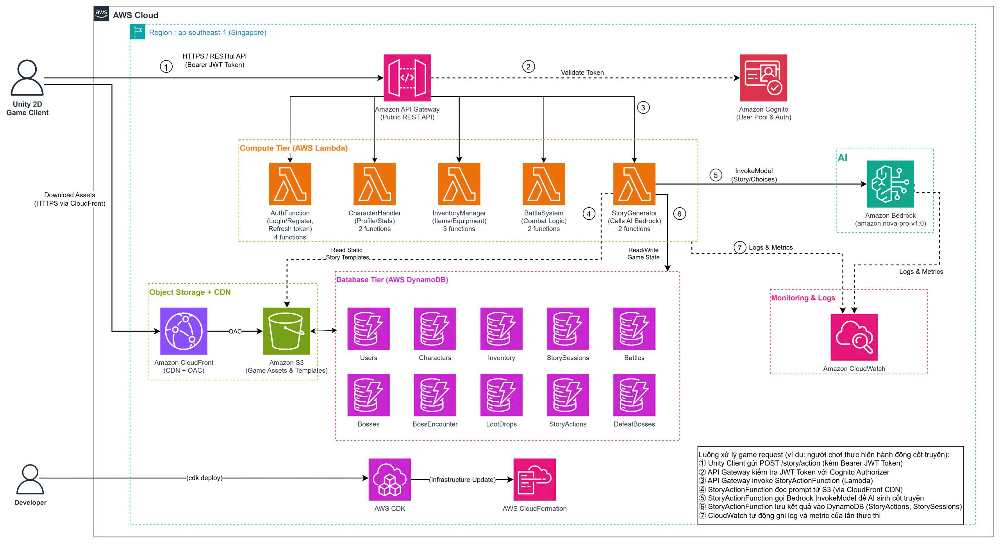

# Đề xuất Dự án: AI Dungeon RPG Adventure Game

## 1. Tóm tắt điều hành

Dự án game 2D tích hợp AI trong việc phát triển cốt truyện là một bước tiến mới trong thể loại game nhập vai phiêu lưu (RPG). Hệ thống kết hợp sự sáng tạo của Trí tuệ Nhân tạo Sinh tạo (Generative AI) với sự mạnh mẽ của kiến trúc đám mây không máy chủ (AWS Serverless). 

Trò chơi cho phép người chơi tạo nhân vật và đắm chìm vào những cuộc phiêu lưu tự do. Cốt truyện, thử thách và các trận đấu Boss (Turn-based) không được lập trình sẵn mà được sinh ra theo thời gian thực (real-time) dựa trên các quyết định của người chơi thông qua **AWS Bedrock** với mô hình **Amazon Nova Pro (`amazon.nova-pro-v1:0`)**. Toàn bộ trải nghiệm được thể hiện sống động qua **Unity 2D Client**, kết nối với hệ thống Backend mạnh mẽ được viết bằng **.NET 8** trên AWS.

## 2. Tuyên bố vấn đề

### Khó khăn của Game RPG Truyền thống
*   **Kịch bản cứng nhắc:** Các game RPG truyền thống thường bị giới hạn bởi các nhánh kịch bản cố định (hard-coded). Dù đầu tư nhiều công sức, nội dung game vẫn sẽ cạn kiệt, khiến người chơi nhanh chóng cảm thấy nhàm chán và giảm tính chơi lại.
*   **Chi phí vận hành khổng lồ:** Việc duy trì các máy chủ game Stateful truyền thống tốn rất nhiều chi phí cho phần cứng rảnh rỗi và gặp khó khăn khi cần mở rộng quy mô (scale) đột ngột.

### Giải pháp đột phá
*   **Cốt truyện động bằng AI:** Ứng dụng mô hình LLM từ **AWS Bedrock (`amazon.nova-pro-v1:0`)** để tự động sinh ra bối cảnh, diễn biến, và phản hồi theo đúng ngữ cảnh hành động của người chơi.
*   **Hạ tầng Serverless linh hoạt:** Toàn bộ logic game (tài khoản, kho đồ, tính toán chiến đấu) được xử lý bởi **AWS Lambda** và lưu trữ cực nhanh qua các bảng cấu trúc **Amazon DynamoDB**, giúp tự động co giãn theo số lượng người chơi và tối ưu chi phí với mô hình trả tiền theo nhu cầu (Pay-as-you-go).

## 3. Kiến trúc giải pháp

Dự án sử dụng 100% kiến trúc Serverless trên nền tảng AWS (Region ap-southeast-1 Singapore), tách biệt hoàn toàn giữa Game Client và Backend để đảm bảo bảo mật và hiệu năng.

*(Sơ đồ kiến trúc tổng thể của hệ thống)*

*   **Amazon API Gateway & Cognito:** Cổng kết nối bảo mật REST API công khai, quản lý xác thực người dùng (Login/Register) và kiểm tra JWT Token thông qua Cognito Authorizer cho mọi request gửi tới.
*   **Object Storage + CDN (Amazon CloudFront & Amazon S3):**
    *   **Amazon CloudFront (CDN + OAC):** Phân phối tài nguyên tĩnh (Static Assets) trực tiếp cho Unity Client với độ trễ cực thấp.
    *   **Amazon S3 (Game Assets & Templates):** Lưu trữ Game Assets và các mẫu prompt cốt truyện tĩnh (Static Story Templates), kết nối an toàn qua Origin Access Control (OAC).
*   **Compute Tier (AWS Lambda - .NET 8):** Hệ thống hàm không máy chủ gồm **13 Lambda functions** chia thành 5 nhóm dịch vụ chính:
    *   `AuthFunction` (4 functions): Đăng nhập, Đăng ký, Refresh Token, Xác thực tài khoản.
    *   `CharacterHandler` (2 functions): Quản lý Profile và Chỉ số nhân vật.
    *   `InventoryManager` (3 functions): Quản lý Vật phẩm, Trang bị và Kho đồ.
    *   `BattleSystem` (2 functions): Quản lý logic Chiến đấu theo lượt (Turn-based RPG).
    *   `StoryGenerator` (2 functions): Xử lý giao tiếp AI Bedrock và sinh cốt truyện (`StoryActionFunction`).
*   **Database Tier (Amazon DynamoDB):** Cơ sở dữ liệu NoSQL độ trễ thấp gồm **10 bảng chuyên biệt**:
    *   `Users`, `Characters`, `Inventory`, `StorySessions`, `Battles`, `Bosses`, `BossEncounter`, `LootDrops`, `StoryActions`, và `DefeatBosses`.
*   **Generative AI (AWS Bedrock):** "Bộ não" sáng tạo của trò chơi, tiếp nhận ngữ cảnh trạng thái game và thực hiện lệnh `InvokeModel` tới mô hình **Amazon Nova Pro (`amazon.nova-pro-v1:0`)** để sinh kịch bản và lựa chọn cho người chơi.
*   **Monitoring & Logging (Amazon CloudWatch):** Tự động thu thập log, lịch sử thực thi và metric hiệu năng của cả Lambda functions và Bedrock AI Invocations.

### Luồng xử lý request game (Ví dụ: Người chơi thực hiện hành động cốt truyện)
1. **Khởi tạo Request:** Unity 2D Client gửi POST request `/story/action` (kèm Bearer JWT Token).
2. **Xác thực:** API Gateway kiểm tra Bearer JWT Token với Cognito Authorizer.
3. **Điều hướng API:** API Gateway gọi hàm `StoryActionFunction` (AWS Lambda).
4. **Đọc Prompt Template:** `StoryActionFunction` đọc prompt template tĩnh từ S3 thông qua CloudFront CDN.
5. **Gọi AI Bedrock:** `StoryActionFunction` gọi `InvokeModel` của Bedrock với mô hình **Amazon Nova Pro (`amazon.nova-pro-v1:0`)** để AI sinh ra nội dung cốt truyện và các lựa chọn.
6. **Lưu trạng thái:** `StoryActionFunction` lưu kết quả vào DynamoDB (`StoryActions`, `StorySessions`).
7. **Ghi Log & Metric:** CloudWatch tự động ghi log và thu thập metrics của đợt thực thi.

## 4. Triển khai kỹ thuật

Dự án áp dụng cấu trúc **Monorepo**, cho phép chia sẻ trực tiếp các Models và cấu trúc dữ liệu (DTOs) giữa C# Unity Client và C# Lambda Backend.
*   **Frontend (Game Client):** Xây dựng bằng Unity (C#) với Universal Render Pipeline (URP) 2D. Giao tiếp với Backend qua HTTPS RESTful API và tải tài nguyên qua CloudFront CDN.
*   **Backend & IaC:** Toàn bộ hạ tầng được định nghĩa bằng mã nguồn (Infrastructure as Code) thông qua **AWS CDK (C#)**. Developer thực hiện lệnh `cdk deploy`, AWS CDK sẽ tự động cập nhật hạ tầng thông qua **AWS CloudFormation**.
*   **Bảo mật:** Sử dụng kiến trúc Server-Authoritative (Backend quyết định kết quả cuối cùng). Mọi thao tác tính toán máu, sát thương, vật phẩm đều thực hiện tại Lambda, ngăn chặn tình trạng gian lận (cheat/hack) từ phía Client.

## 5. Lộ trình & Mốc triển khai

*   **Milestone 1 (22/06/2026 - 05/07/2026):** Hoàn thiện kiến trúc tổng thể, thiết lập AWS CDK, triển khai thành công Amazon Cognito (Đăng nhập/Đăng ký), S3/CloudFront CDN và 10 bảng DynamoDB.
*   **Milestone 2 (06/07/2026 - 19/07/2026):** Tích hợp AWS Bedrock (`amazon.nova-pro-v1:0`), xây dựng hệ thống tạo `Prompt` tự động dựa trên mẫu S3 và bộ phân tích phản hồi (Response Parser) để đưa dữ liệu JSON của AI vào game.
*   **Milestone 3 (20/07/2026 - 02/08/2026):** Hoàn thiện logic Backend cho các tính năng: Chiến đấu theo lượt (Turn-based RPG Battle), Sinh Boss, Rớt đồ (LootDrops), Quản lý vật phẩm (Inventory).
*   **Milestone 4 (03/08/2026 - 15/08/2026):** Tích hợp hoàn chỉnh Unity Client với Backend API, kiểm thử toàn diện (End-to-End Testing) và tối ưu hóa độ trễ phản hồi của AI.

## 6. Ước tính ngân sách

Một trong những ưu điểm lớn nhất của dự án là khả năng tận dụng triệt để gói miễn phí (Free Tier) của AWS trong giai đoạn thử nghiệm:
*   **AWS Cognito / Lambda / DynamoDB / S3 & CloudFront:** $0.00 (Hoàn toàn nằm trong hạn mức miễn phí của AWS).
*   **AWS Bedrock (`amazon.nova-pro-v1:0`):** Tính theo lượng Token sử dụng (khoảng $1.00 - $5.00/tháng cho lưu lượng test).
*   **Amazon API Gateway & CloudWatch:** Khoảng $0.50 - $1.00/tháng.
*   **Tổng chi phí dự kiến:** **~$1.50 - $6.00 / tháng**. Một con số cực kỳ lý tưởng cho một hệ thống game có khả năng chịu tải cao.

## 7. Đánh giá rủi ro

| Rủi ro | Tác động | Giải pháp Giảm thiểu |
| :--- | :--- | :--- |
| **Độ trễ AI (Bedrock Latency)** | Cao | Tích hợp hiệu ứng "loading/typing" mượt mà trên Unity Client để che giấu thời gian chờ API. |
| **AI sinh dữ liệu sai JSON** | Trung bình | Backend có các Module kiểm tra tự động (Validator) và cơ chế tự động Fallback/Retry nếu cấu trúc trả về bị lỗi. |
| **Vượt chi phí Token AI** | Thấp | Cấu hình giới hạn `max_tokens` nghiêm ngặt cho Bedrock và đặt cảnh báo ngân sách tự động (AWS Budgets). |

## 8. Kết quả kỳ vọng

*   **Trải nghiệm người chơi đột phá:** Một tựa game không bao giờ cũ nhờ khả năng sáng tạo kịch bản vô hạn của AI.
*   **Hệ thống Framework chuẩn mực:** Tạo ra một bộ khung kiến trúc (Architecture Framework) vững chắc kết hợp giữa Unity 2D và AWS .NET 8 Serverless. Bộ khung này có thể dễ dàng tái sử dụng và mở rộng cho các dự án game trực tuyến hoặc ứng dụng tương tác sau này.
*   **Tối ưu hiệu quả vận hành:** Minh chứng cho việc xây dựng và duy trì hệ thống Game Online phức tạp với chi phí hạ tầng gần như bằng 0 trong giai đoạn đầu.