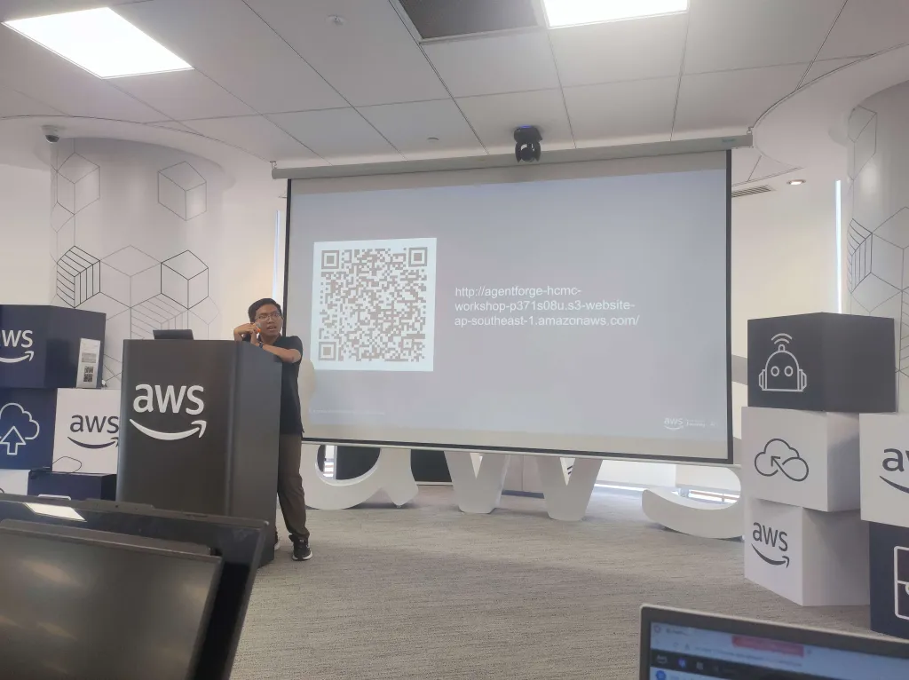

# Event Report: "AWS FCAJ Agent Forge & Agentic AI Build Week"

### Event Overview

On **August 1, 2026**, I attended the **AWS FCAJ Agent Forge - Deepdive** community event hosted by AWS Study Group at Bitexco Financial Tower (26th Floor). The event focused on advanced **L300-level Agentic AI architecture**, moving Generative AI applications from Proof-of-Concept (PoC) prototypes to production-ready Cloud deployments on AWS.

The session brought together experienced Cloud Architects, AI Engineers, and enthusiastic developers to unpack four major enterprise challenges: **Performance, Scalability, Security, and Governance**.

---

### Key Technical Insights

#### 1. Agentic AI & The Spectrum of Autonomy
* **Beyond Standard LLMs:** Unlike simple token prediction models, Agentic AI introduces autonomous reasoning, multi-step planning, and tool execution (`Reasoning → Planning → Execution`).
* **Autonomy Levels:** Ranging from simple prompt-response assistants to fully autonomous multi-agent systems executing long-running background jobs.

#### 2. Core 5-Layer Agent Architecture
* **Brain (LLM Reasoning):** Leveraging Anthropic Claude (Sonnet/Haiku) and Amazon Nova models for logic and coding tasks.
* **System Prompt & Role Rules:** Defining agent boundaries, behavioral limits, and response style.
* **Knowledge & Context:** Connecting enterprise data via Vector DBs and RAG pipelines.
* **Action Tools:** Connecting agents to external APIs (Webhooks, Database queries, Gmail API).
* **Memory & Observability:** Tracking session history (short-term & long-term memory) and monitoring telemetry via Amazon CloudWatch.

#### 3. Modern AI Protocols (MCP & A2A)
* **Model Context Protocol (MCP):** Standardizing how AI agents interact with external tools and plugins.
* **Agent-to-Agent (A2A) Protocol:** Enabling autonomous communication and task delegation between specialized agents.
* **AWS Strands SDK & Factory Pattern:** Utilizing open-source SDKs and Factory design patterns to instantiate agents cleanly (`Model + System Prompt + Tools`).

#### 4. Amazon Bedrock Agent Core Infrastructure
* **Firecracker MicroVM Isolation:** Running user agent sessions in hardware-isolated microVMs to guarantee zero data leakage between tenants.
* **Identity & Security (WAT):** Utilizing **Workload Access Tokens (WAT)** to exchange credentials securely without exposing user JWTs to external tools.
* **Enterprise Gateway & Human-in-the-Loop (HITL):** Implementing middleware rules for administrative approval on high-risk agent decisions.

#### 5. Hands-on Vibe Coding & AgentCore CLI
* **Kiro IDE Steering Rules:** Setting up `.kiro/steering.md` guidelines to direct AI assistants to generate clean, AWS-compliant C# and Python code.
* **3-Step Deployment via `agentcore CLI`:**
  1. `agentcore init my-agent` — Scaffold project structure.
  2. `agentcore configure` — Link LLM model and System Prompts.
  3. `agentcore deploy` — Instantly host serverless agent runtime on AWS.

---

### Personal Takeaways & Application to My Project

Participating in this event provided immense value for my internship project (**AI Dungeon RPG Adventure Game**):

* **AI Story Generation Integration:** Applied the concept of prompt context and Bedrock Runtime API to generate dynamic RPG adventure branches for the game backend.
* **Structured Choice Parsing:** Learned how to enforce strict JSON schemas on AI responses to cleanly parse story options into C# DTOs.
* **Production-Ready Security Mindset:** Understood how to protect credentials and manage API timeouts gracefully when calling AI model endpoints.

#### Event Gallery

> **Summary:**
> The Agent Forge Deepdive event equipped me with a production-grade mindset for building Agentic AI systems. It was an inspiring milestone that directly influenced how I design serverless AI features for my internship project!
