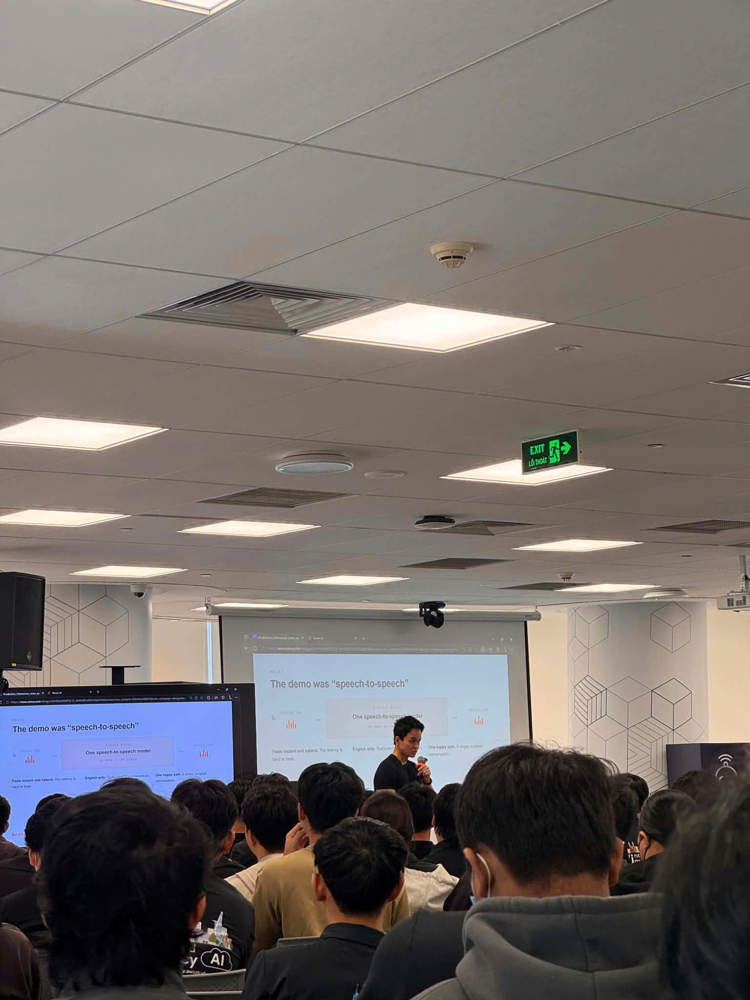

# Báo cáo thu hoạch chi tiết: "AWS FCAJ Agent Forge & Agentic AI Build Week"

### 1. Thông tin chung & Diễn giả sự kiện

* **Tên sự kiện:** AWS FCAJ Agent Forge - Deepdive & Agentic AI Build Week
* **Thời gian:** 09:00 – 12:30, Ngày 01 tháng 08 năm 2026
* **Địa điểm:** Tầng 26, Tòa nhà Bitexco Financial Tower, Số 02 Đường Hải Triều, Phường Bến Nghé, Quận 1, TP. Hồ Chí Minh
* **Đối tượng tham dự:** Kỹ sư AI, Cloud Architect, Lập trình viên và Cộng đồng yêu công nghệ AWS
* **Đơn vị tổ chức (Host):** AWS Study Group & First Cloud AI Journey (FCAJ)
* **Danh sách Diễn giả (Speakers):**
  * **Anh Nghĩa** – Diễn giả chính (Phụ trách phần Lý thuyết Kiến trúc L300 & Agent Core Topology)
  * **Anh Hải Anh** – Diễn giả thực hành (Phụ trách phần Demo Vibe Coding với Kiro IDE & AgentCore CLI)

---

### 2. Mục đích & Mục tiêu sự kiện

Sứ mệnh cốt lõi của buổi **AWS FCAJ Agent Forge - Deepdive** là trang bị phương pháp luận và công cụ giúp các kỹ sư chuyển đổi ứng dụng Generative AI từ dạng thử nghiệm (Proof-of-Concept - PoC) lên môi trường chạy thực tế doanh nghiệp (Production-ready) trên đám mây AWS.

Sự kiện đã tập trung giải quyết **4 trụ cột cốt lõi** khi đưa AI Agent vào hệ thống lớn:
1. **Hiệu năng (Performance):** Tối ưu độ trễ (Latency) và phản hồi dạng luồng (Streaming Response).
2. **Khả năng mở rộng (Scalability):** Vận hành hàng trăm Agent chạy ngầm theo kiến trúc Serverless.
3. **Bảo mật (Security):** Tách biệt dữ liệu tuyệt đối giữa các người dùng (User Isolation) và bảo vệ Token định danh.
4. **Quản trị (Governance):** Thiết lập Cổng kiểm soát chính sách với cơ chế can thiệp của con người (Human-in-the-Loop).

---

### 3. Nội dung kỹ thuật chi tiết & Kiến thức tiếp thu

#### A. Triết lý Agentic AI & Dải mức độ tự chủ (Spectrum of Autonomy)
Khác với các mô hình LLM truyền thống vốn chỉ đóng vai trò dự đoán từ tiếp theo hoặc trả lời câu hỏi dạng Chatbot đơn thuần, **Agentic AI** là lớp phần mềm thông minh có tính tự chủ cao. Một AI Agent vận hành dựa trên vòng lặp liên tục:

$$\text{Tự lập luận (Reasoning)} \longrightarrow \text{Lập kế hoạch (Planning)} \longrightarrow \text{Thực thi tác vụ (Execution)}$$

Sự kiện phân loại mức độ tự chủ của AI thành dải 4 cấp độ:
* **Cấp độ 1 (Simple Assistant):** Giao diện hỏi - đáp 1 lượt cơ bản dựa trên mô hình LLM.
* **Cấp độ 2 (Deterministic Workflow):** Luồng công việc cố định do lập trình viên định nghĩa, LLM chỉ đóng vai trò trích xuất dữ liệu cấu trúc.
* **Cấp độ 3 (Human-in-the-Loop Workflow):** Agent tự chủ lập kế hoạch và gọi công cụ, nhưng các hành động rủi ro bắt buộc phải có sự phê duyệt của con người.
* **Cấp độ 4 (Fully Autonomous Multi-Agent Systems):** Hệ thống nhiều Agent tự phối hợp, phân chia công việc ngầm kéo dài (Long-running background jobs) và tổng hợp kết quả đa thức cho người dùng.

#### B. Kiến trúc 5 lớp Production của một AI Agent
Để triển khai một AI Agent vững chắc trên hạ tầng AWS, kiến trúc hệ thống cần bóc tách rõ ràng 5 thành phần:

1. **Bộ não (Brain / LLM Reasoning):** Các mô hình ngôn ngữ lớn đóng vai trò trung tâm lập luận. Phổ biến như **Anthropic Claude 3.5 Sonnet** (tối ưu cho logic phức tạp và viết code), **Claude 3 Haiku** (tốc độ siêu nhanh, chi phí rẻ) hoặc **Amazon Nova**.
2. **System Prompt & Quy tắc Steering:** Định hình nhân dạng, vai trò, giới hạn nghiệp vụ và cấu trúc dữ liệu đầu ra cho Agent.
3. **Bộ nhớ & Ngữ cảnh (Knowledge Base / Context):** Kết nối dữ liệu nội bộ doanh nghiệp thông qua RAG và CSDL Vector (như OpenSearch Serverless).
4. **Công cụ thực thi (Tools & Action Invocation):** Cho phép Agent tương tác với thế giới bên ngoài (truy vấn SQL, gọi REST Webhook, gửi Email qua Gmail API).
5. **Giám sát & Lưu vết (Memory & Observability):** Lưu trữ bộ nhớ ngắn hạn/dài hạn phiên làm việc và ghi nhận toàn bộ nhật ký hoạt động trên **Amazon CloudWatch**.

#### C. Giao thức kết nối thế hệ mới (MCP & A2A) & Framework AWS Strands
* **Model Context Protocol (MCP):** Giao thức chuẩn hóa mới thay thế REST API truyền thống cho việc kết nối giữa AI Agent và các công cụ/plugin bên ngoài.
* **Agent-to-Agent (A2A) Protocol:** Chuẩn giao tiếp cho phép các Agent chuyên biệt tự trao đổi dữ liệu và phân công nhiệm vụ trực tiếp cho nhau.
* **AWS Strands SDK & Factory Pattern:** Bộ Open-source SDK do AWS phát triển kết hợp với **Factory Design Pattern** giúp khởi tạo Agent nhanh chóng bằng cách đóng gói:

$$\text{Agent} = \text{Mô hình LLM} + \text{System Prompt} + \text{Danh sách Tools}$$

#### D. Hạ tầng Amazon Bedrock Agent Core & Bảo mật Enterprise
* **Công nghệ cách ly Firecracker MicroVM:** Môi trường Bedrock Agent Core vận hành mỗi phiên làm việc của người dùng trên một **Firecracker MicroVM** riêng biệt. Điều này mang lại sự cách ly tuyệt đối về phần cứng, bộ nhớ và file system, đảm bảo 100% không rò rỉ dữ liệu giữa các người dùng (Zero Cross-tenant Leakage).
* **Luồng bảo mật 5 bước với Workload Access Token (WAT):**
  1. *Yêu cầu đầu vào:* Client gửi request kèm JWT Token hoặc Cognito Credential.
  2. *Đổi Token:* Agent Core chuyển đổi JWT của User thành **Workload Access Token (WAT)**.
  3. *Ủy quyền công cụ:* WAT được đổi sang Token tương ứng của Tool (OAuth/API Key) lưu trong kho khóa mã hóa Token Vault.
  4. *Thực thi an toàn:* Tool thực thi tác vụ mà không bao giờ làm lộ JWT gốc của người dùng.
  5. *Trả kết quả:* Trả dữ liệu đã qua bộ lọc về cho Client.
* **Enterprise Gateway & Human-in-the-Loop (HITL):** Đóng vai trò lớp Middleware trung gian. Ví dụ: yêu cầu hoàn tiền dưới 100$ được Agent tự động xử lý, nhưng trên 100$ sẽ tự động kích hoạt luồng chuyển quản trị viên phê duyệt.
* **PII Interceptors:** Bộ lọc an toàn tự động loại bỏ thông tin định danh cá nhân (PII) ở cả chiều Inbound prompt và Outbound completion.

#### E. Thực hành Hands-on Lab với Kiro IDE & `agentcore CLI`
* **Kiro IDE & Steering Rules:** Cấu hình file quy tắc `.kiro/steering.md` để định hướng AI trợ lý trong Kiro IDE tự động sinh code C# và Python tuân thủ chuẩn kiến trúc AWS Strands SDK.
* **Quy trình 3 lệnh triển khai siêu tốc:**
  1. `agentcore init my-first-agent` — Tự động khởi tạo cấu trúc thư mục chuẩn (`agent.py`, `config.yaml`, `requirements.txt`).
  2. `agentcore configure --model anthropic.claude-3-5-sonnet` — Liên kết bộ não LLM và thiết lập System Prompt.
  3. `agentcore deploy --env dev` — Đóng gói và đưa Agent lên môi trường Firecracker MicroVM của Bedrock Agent Core chỉ trong vài giây.

---

### 4. Ứng dụng trực tiếp vào Đồ án thực tập (AI Dungeon RPG)

Kiến thức từ sự kiện **FCAJ Agent Forge** đã tác động trực tiếp và giúp em hoàn thiện kiến trúc cho dự án **AI Dungeon RPG Adventure Game**:

1. **Tích hợp Backend Serverless AI:** Áp dụng cơ chế gọi Amazon Bedrock Runtime API trong Backend .NET 8 AWS Lambda (`/story/next` endpoint) để sinh ra kịch bản phiêu lưu ngẫu nhiên dựa trên trạng thái nhân vật.
2. **Ràng buộc cấu trúc đầu ra JSON:** Áp dụng kỹ thuật System Prompt Steering học từ sự kiện để ép mô hình Claude LLM trả về cấu trúc JSON chuẩn, giúp deserialize mượt mà thành các DTO `StoryNodeResponse` trong C#.
3. **Tăng cường khả năng chịu lỗi (Resilience & Fallback):** Thiết lập cơ chế timeout (5 giây) và bộ lọc lỗi để xử lý khi dịch vụ AI bị trễ, đảm bảo luồng chơi game trong Unity Client không bao giờ bị gián đoạn.

---

### 5. Hình ảnh kỷ niệm sự kiện

---

### 6. Lời kết & Đánh giá tổng quan

Sự kiện **AWS FCAJ Agent Forge - Deepdive** là một cột mốc học hỏi quan trọng và cực kỳ giá trị trong kỳ thực tập của em. Sự kiện không chỉ mở rộng tầm nhìn về kiến trúc Agentic AI chuyên nghiệp trên nền tảng AWS Cloud mà còn cung cấp những kỹ năng thực hành Vibe Coding vô cùng hiện đại, giúp em tự tin áp dụng vào việc xây dựng sản phẩm game AI Dungeon RPG đạt tiêu chuẩn chất lượng cao!
